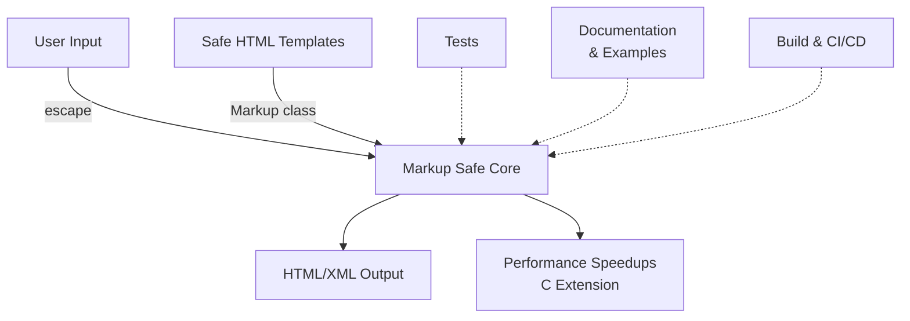

# Overview

<!-- Maintained by Tidewiki. Edits are kept on later updates; wrap text in tidewiki:keep markers to freeze it. -->

MarkupSafe is a Python library that safely handles untrusted text in HTML and XML contexts. It implements a `Markup` class and `escape()` function that convert special characters to HTML entities, preventing injection attacks while allowing safe markup to pass through unmodified [`README.md:5-9`](https://github.com/tidewiki-demos/markupsafe/blob/b8ed616eb769578eac1bfb0eb42316be5a39e16b/README.md#L5-L9).

## What It Does

MarkupSafe solves a fundamental web security problem: displaying user-provided text safely in HTML without executing it as code. For example, if a user enters `<script>alert('xss')</script>`, MarkupSafe converts it to `&lt;script&gt;alert('xss')&lt;/script&gt;` so it displays as text rather than executing [`README.md:14-32`](https://github.com/tidewiki-demos/markupsafe/blob/b8ed616eb769578eac1bfb0eb42316be5a39e16b/README.md#L14-L32).

The library provides two main tools:

1. **`escape()` function** – converts unsafe text to safe HTML by escaping special characters
2. **`Markup` class** – a string subclass that marks text as "already safe" and automatically escapes any untrusted values mixed into it

## Main Building Blocks



**Core Components:**

- **[Markup Safe Core](markup-safe-core.md)** – The `Markup` class and `escape()` function that form the foundation, handling character escaping and safe text marking
- **[Performance Speedups](performance-speedups.md)** – C extension module optimizing escape operations for production use
- **[Testing Suite](testing-suite.md)** – Comprehensive tests ensuring escaping works correctly and prevents injection attacks
- **[Build and Packaging](build-packaging.md)** – Configuration for creating and distributing the library on PyPI
- **[CI and Workflows](ci-workflows.md)** – GitHub Actions for automated testing, quality checks, and releases
- **[Development Setup](development-setup.md)** – Environment configuration for contributors
- **[Documentation](documentation.md)** – User guides and API reference
- **[Benchmark](benchmark.md)** – Performance measurement tools

## Running the Project

MarkupSafe requires Python 3.10 or later [`pyproject.toml:19`](https://github.com/tidewiki-demos/markupsafe/blob/b8ed616eb769578eac1bfb0eb42316be5a39e16b/pyproject.toml#L19).

### Installation

For end users, install from PyPI:
```bash
pip install MarkupSafe
```

### Development Setup

To work on the codebase, see [Development Setup](development-setup.md) for environment configuration.

### Running Tests

The project uses pytest for testing [`pyproject.toml:49-51`](https://github.com/tidewiki-demos/markupsafe/blob/b8ed616eb769578eac1bfb0eb42316be5a39e16b/pyproject.toml#L49-L51):
```bash
pytest
```

The test suite runs across multiple Python versions using tox [`pyproject.toml:129-137`](https://github.com/tidewiki-demos/markupsafe/blob/b8ed616eb769578eac1bfb0eb42316be5a39e16b/pyproject.toml#L129-L137).

### Building Documentation

Build the Sphinx documentation:
```bash
tox run -e docs
```

Or for continuous rebuilding during development:
```bash
tox run -e docs-auto
```

## Quick Example

```python
from markupsafe import Markup, escape

# Escape untrusted input
unsafe = "<script>alert('xss')</script>"
safe = escape(unsafe)  # Markup('&lt;script&gt;alert(&#39;xss&#39;)&lt;/script&gt;')

# Use Markup for safe templates
template = Markup("<strong>{text}</strong>")
result = template.format(text=unsafe)  # Escapes the variable automatically
```

See the README examples [`README.md:12-33`](https://github.com/tidewiki-demos/markupsafe/blob/b8ed616eb769578eac1bfb0eb42316be5a39e16b/README.md#L12-L33) for more use cases.

## How to Navigate This Wiki

- Start with **[Markup Safe Core](markup-safe-core.md)** to understand the `Markup` class and `escape()` function
- For performance details, see **[Performance Speedups](performance-speedups.md)**
- If contributing, read **[Development Setup](development-setup.md)** then **[Testing Suite](testing-suite.md)**
- For release information, see **[CI and Workflows](ci-workflows.md)** and **[Build and Packaging](build-packaging.md)**
- Project documentation is described in **[Documentation](documentation.md)**
